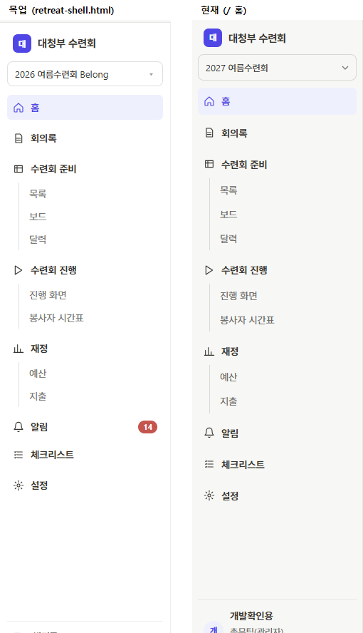

# 검토용 보고

작성 시각: 2026-09-07 (KST)
커밋: a74d57c (브랜치 `main` · 이 단계의 마지막 코드 커밋 · 보고 커밋은 그 뒤)
작업: UI 개편 단계 2 — 홈 (+ 단계 1 검토 후속)

---

## 0. 먼저 센 것 (운영 DB 사본 — 코드 수정 전)

| 센 것 | 값 |
|---|---|
| ReviewRequest 행 | **1행** — status 대기 1 |
| └ 가리키는 것 | task_id 있음 **0** · file_asset_id 있음 **1** (파일 「1일차 집회 큐시트」) · 둘 다 없음 0 |
| └ 스키마 | `task_id` FK 는 **옛 `tasks` 표**(Task)를 가리킨다. TaskRun 아님. **행은 0이라 옮길 데이터는 없다** — 단계 4 의 화면 통합에서 Review 가 Task 를 가리키는 것은 스키마 사실로만 남는다 |
| Notification 행 | **1305건** |
| └ 바로가기 url | `/tasks/{id}`(옛 Task) **0** · `/board?task=`(TaskRun) **0** · **전부 `/tasks?retreat_id=N` 1305건** (목록 주소 — 개별 업무 링크가 아예 없다) |

> 단계 3 의 `/tasks/{id}` 301 은 **옛 링크를 받을 일이 사실상 없고**(알림이 목록
> 주소만 써 왔다), 단계 4 의 바로가기 갱신도 마이그레이션 없이 새 알림부터
> `/tasks?task=` 를 쓰면 된다.

## 1. 단계 1 검토 후속 (a~h)

| # | 한 것 | 근거 |
|---|---|---|
| a | 최근.md 머리의 커밋 = 이 단계의 마지막 **코드** 커밋. 보고 커밋은 그 뒤라고 명시 | 이 파일 머리 |
| b | period.py 를 `retreat.end_date`·`retreat.is_archived` 직접 접근으로 — 속성 없으면 터진다 | `test_p01_속성이_없는_객체는_삼키지_않고_터진다` |
| c | 배지 글자색 — 대기 `#8A5A12` · 지연 `#A33F38` · 완료 `#5F5E5A` (채움 그대로). 4-0 표 + retreat.css + 목업(배지 자리만) 함께. 9장에 「배지 글자도 4.5:1」 한 줄 | `test_s01`(문서↔CSS) · `test_s13`(대비 — 계산값 대기 5.36 · 지연 5.54 · 완료 5.64 · 진행중 5.54) |
| d | 옛 알림함 상단 「답 기다리는 확인 요청 N건 → /reviews」 — 0건이면 없음 | `test_h09` (0건 없음 · 1건 있음) |
| e | 구설계 사용자 POST(`/users/create` · `/users/{id}/update`) 삭제. 지우기 전 grep: **템플릿·JS 참조 0곳** (tests 만 6곳 → `conftest.make_user` 로 교체). 14장 표에 「단계 2 · 지움」 행 | grep 결과 0곳 · pytest 전체 초록 |
| f | 3장에 「회차 준비(초안) 홑 항목 — active_draft 일 때만, 부서 리더의 유일한 길(6-7)」 | CLAUDE.md 3장 |
| g | check_names **실명 38개** · 걸림 0 · 안 고친 곳 0곳. 목업의 임시 가명 정하윤 → 확정 가명 **박서진** (그 한 자리만 — 바꾼 뒤 정하윤 0곳) | 아래 「시험」 · grep |
| h | 사이드바 시각값을 목업 CSS 숫자 그대로 — 로고 26×26 r7 accent · 드롭다운 r8 `--rule-2` padding 7×10 + ▾ · 항목 7×8 r6 · 그룹 간격 6px · 하위 16px+가이드선 · 사용자 카드 세 줄(이름·역할·부서) · 로그아웃은 설정 › 내 정보에만 · `--sw` 232→**240px** | `test_s14`(세 줄 nowrap·말줄임·240px) · 아래 캡처 |

### 사이드바 나란히 (240px)

**남은 차이 표**

| 무엇 | 목업 값 | 현재 값 | 이유 |
|---|---|---|---|
| 사이드바 면 | `#FFFFFF` | `#F7F7F5`(`--side`) | 4-0 표가 사이드바 면을 `#F7F7F5` 로 정한다 — 목업과 문서가 어긋나면 문서가 정본 |
| 하위·카드 글자 | 13.5px / 13·12px | 14px / 14·13px | 4-0 글자 눈금(혼자 뜻 14 · 보조 13)과 `test_typescale`. A 판에서 문서를 이미 눈금 쪽으로 고쳤다 |
| 줄 간격 | 1.5 | 1.65 (body 공통) | ts_05 — 글자만 키우고 간격이 그대로면 답답해진다. 사이드바만 따로 줄이지 않는다 |
| 알림 배지 「14」 | 예시 값 | 없음 | 실데이터 0건 — 0이면 없음 규칙 (4-0) |

## 2. 종료 판정 한 곳

- `diagnosis.py`(4-10) · `live.py`(5-6) 가 `period.is_over` 를 부른다. 두 곳의
  기존 시험 95개 그대로 통과.
- **`end_date <` 꼴 판정이 period.py 밖에 0곳** — grep 을 시험으로 박았다
  (`test_p03_종료_판정이_한_곳이다`). 폐회일이 비면 개회일로 물러서는 폴백은
  두 곳이 원래 하던 것이라 period 로 함께 옮기고 4-10 에 한 줄 적었다.

## 3~8. 홈

- `/` 가 홈 (`routers/home.py` · `templates/home.html` · **숫자는 전부
  `domain/home.build`**). 보드는 `/board` 그대로, 사이드바 홈이 `/` 로 간다.
- 지표 4칸 = `board.overdue_of` · `escalation.unassigned_runs_due_soon`(새 함수 —
  기준 상수는 옛 scan_risks 와 공유) · `budget.build_budget_summary`.
  **시험이 같은 DB 로 화면 값과 도메인 값을 견준다** (`test_h02`).
  라우터·템플릿에 세는 코드 없음 (`test_h03` — 낱말 검사이지만 주석까지 걷은
  것은 아니라서, 실제로 주석의 낱말에 한 번 걸려 주석을 고쳤다. 10장 그 모양).
- 경고 띠 0건 없음/1건 있음 (`test_h04`). 내 할 일 = 내 담당·미완료·마감≤오늘·
  오름차순 (`test_h05`). 완료에 D+N 없음 — 완료는 목록에 아예 없고, 미완료
  지연에는 D+ 가 붙는 것까지 함께 본다 (`test_h06`).
- 결산 전환 넷 — 개회일+1 보통 · 폐회일 당일 보통 · 폐회일+1 결산 ·
  is_archived 결산, 전부 now 주입 (`test_p02` · `test_h07`). 결산 홈 값
  (미지급 환급 · 영수증 없는 지출 · 미완료)은 옛 /refunds 기준 그대로 —
  단계 5 에서 바뀌면 그때 따라간다.
- 옛 `/dashboard` 삭제 → `/` 301 (`test_h08`). 14장 표 「지움」.

## 수용 기준

| # | 기준 | 결과 | 근거 |
|---|---|---|---|
| 1 | 0번 표 | 통과 | 위 표 |
| 2 | 1-a~h 근거 | 통과 | 위 표 (시험 이름·grep·숫자·캡처) |
| 3 | 종료 판정 한 곳 | 통과 | `test_p03` (grep 0곳을 시험으로) |
| 4 | / 홈 · /dashboard 301 | 통과 | `test_h01` · `test_h08` |
| 5 | 지표 = 도메인 값 | 통과 | `test_h02` |
| 6 | 경고 띠 0/1건 | 통과 | `test_h04` |
| 7 | 결산 전환 넷 | 통과 | `test_p02` · `test_h07` (now 주입) |
| 8 | 완료에 D+N 없음 | 통과 | `test_h06` |
| 9 | 배지 셋 4.5:1 · test_s01 | 통과 | `test_s13`(넷 다 잰다) · `test_s01` |
| 10 | 나란히 캡처 + 차이 표 + 카드 세 줄 | 통과 | 위 캡처·표 · `test_s14` |
| 11 | drawer.js 보드·달력 | 통과 | **보드 73/73 · 달력 73/73** (1440×900, dev 서버). 숨은 탭의 타이머 스로틀로 검사가 늘어져 워커 타이머로 sleep 만 우회해 돌렸다 — 검사 항목 자체는 그대로다 |
| 12 | pytest 전부 · check_names | 통과 | `973 passed` · 실명 **38**개(파일 208) · 걸림 0 · 안 고친 곳 0곳 · 대응표에 없는 표기 0개 |

## 시험

- pytest (옵션 없이 · 검토자 반영 뒤 마지막 실행): `973 passed in 511.47s (0:08:31)`
- 새 시험: `tests/test_home.py` 12개 (period 셋 + 홈 아홉) ·
  `test_shell.py` 에 `test_s13`(배지 대비) · `test_s14`(카드 세 줄).
- 고친 시험: typescale `흐려도_되는곳` 에 `.sidenav .pick .caret`(▾ — 옆의
  회차 이름이 뜻을 짐) 한 곳. 옛 `/users/create` 픽스처 7곳 →
  `conftest.make_user`.

## 검토자 판정과 반영

**막아야 함 없음 · 고쳐야 함 5 · 봐 둘 것 5.** 원문은 채팅 덩어리에 그대로.
커밋 전에 반영한 것:

1. 홈의 소속 외 흐림을 **부서 키로** — `home.build` 가 `department_key_of` 로
   `dim_ids` 를 계산해 넘긴다 (`test_h10` — 같은 키의 다른 회차 부서 행에 묶인
   계정도 자기 부서는 선명). 옛 껍데기 네 화면의 `is_other_dept`(id 비교)는
   각 단계에서 다시 만들 때 걷는다 — 홈만 먼저 갔다.
2. 로그인·초대 진입 → `/`(홈) (invite.py 두 곳 · error.html 「홈으로」 ·
   base.html 브랜드). `test_02_링크로_들어오고…` 가 /board 가 아님을 잰다.
   **마법사 완료 후 /board 행은 그대로** — 만든 보드를 바로 보여주는 의도.
3. 구설계 POST 404 시험 추가 (`test_h08b`) — 지워진 것이 실제로 지워졌는가.
4. 경고 띠 둘째 줄에 「목록에서 보기」 링크 — 4-15 「(→ 목록)」 이 정본.
5. README 표에 `/` 홈 행 추가 · 「준비 단계 보드」 → 「수련회 준비 — 보드」.
6. (봐 둘 것 6) 목업 `.chip.due` 글자도 `#A33F38` 로.
7. (봐 둘 것 8) 0번 표의 Notification 1305건은 **사본 시점** 수 — 검토자
   재조회로는 1483건이고 결론(전부 목록 주소·개별 링크 0)은 그대로 성립.

**사람에게 넘기는 것** — 두 진한 빨강(`--st-late-fg #A33F38` vs `--now-ink
#A3423B`)을 합칠지 · 저장 status '지연' 인데 날짜상 미초과인 행이 홈에서
「대기」 로 보이는 것(4-3 메모의 방향대로 두었다) · 홈의 「미지급 환급 N건」
(지출 건수)과 /refunds 화면(결제자별 묶음)의 행 수가 다를 수 있는 것.

## 판단이 들어간 자리

1. **period 의 개회일 폴백** — 4-10·5-6 이 원래 `end_date or start_date` 로
   판정해 왔다. 통합하며 이 폴백을 period 로 옮기고 4-10 에 한 줄 적었다 —
   버리면 두 곳의 기존 시험이 재던 동작이 바뀐다.
2. **escalation 에 run 용 함수 신설** — 옛 scan_risks 는 구설계 Task(due_date)
   전용이라 TaskRun 을 못 받는다. 같은 상수(`UNASSIGNED_ESCALATION_DAYS`)를
   쓰는 `unassigned_runs_due_soon` 을 더했다 — 잣대는 하나다.
3. **홈 경고 띠의 「목록에서 보기」 링크는 아직 필터 없이 `/tasks`** — 지연
   필터는 단계 3 의 새 목록에서 `?state=` 로 잇는다 (템플릿 주석에 적음).
4. **결산 홈의 셋** — 미지급 환급 = `subsidy_amount>0 & paid=False`(옛 /refunds
   기준), 영수증 없음 = `receipt_file_url` 없음. 단계 5 에서 기준이 바뀌면
   그때 함수째 따라간다 (지시문 7 그대로).
5. **목업 카드 글자(13/12px)와 하위(13.5px)는 눈금이 이겼다** — 남은 차이 표.
